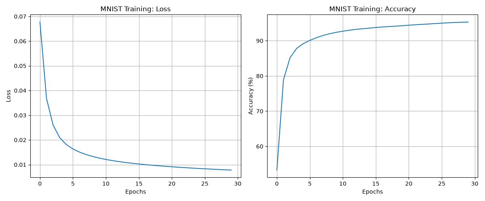

# Simple Neural Network
## Infos
This is an example of an NN in Python with just Numpy and works  well with the MNIST test set. Tensorflow is only used for loading the dataset.
> Its supposed to be simple and not meant to be overly performant or fast, altough the speed is pretty decent for such a simple network.

## Network
- **Input Layer:** 784 Neurons
- **Hidden Layer 1:** 32 Neurons
- **Hidden Layer 2:** 16 Neurons
- **Output Layer:** 10 Neurons

## Output
### Console
``` console
Epoch 1: Loss = 0.0677, Accuracy = 53.2483%, Time = 14.01 sec
Epoch 2: Loss = 0.0367, Accuracy = 78.9117%, Time = 19.40 sec
Epoch 3: Loss = 0.0260, Accuracy = 85.1983%, Time = 19.54 sec
Epoch 4: Loss = 0.0209, Accuracy = 87.8217%, Time = 16.70 sec
Epoch 5: Loss = 0.0181, Accuracy = 89.1867%, Time = 20.50 sec
Epoch 6: Loss = 0.0163, Accuracy = 90.1067%, Time = 19.99 sec
Epoch 7: Loss = 0.0151, Accuracy = 90.8617%, Time = 19.50 sec
Epoch 8: Loss = 0.0141, Accuracy = 91.4950%, Time = 19.93 sec
[...]
```
### Matplotlib Graph



## Result
As we can see Numpy gives good performance for such a simple Neural Network, even without batching
